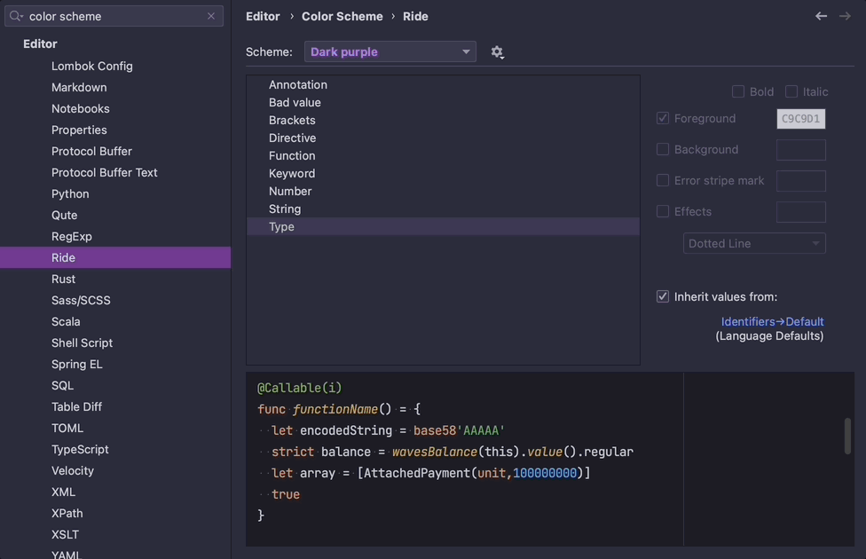
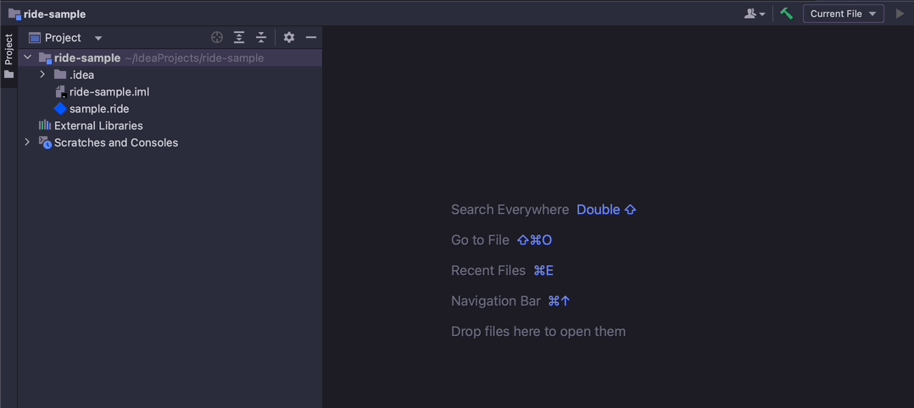
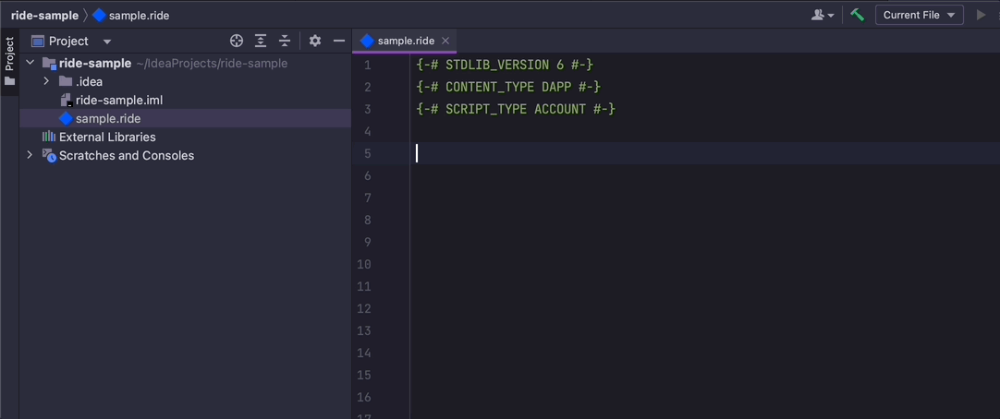
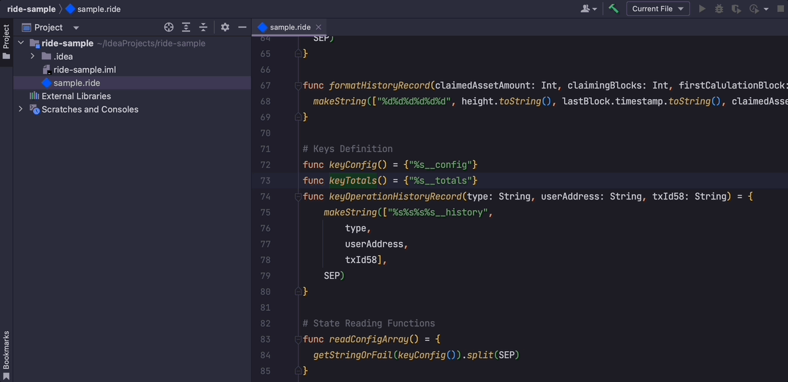
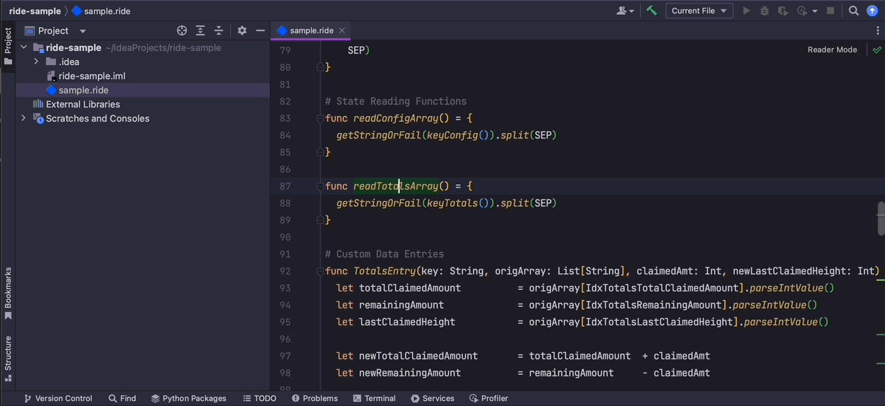
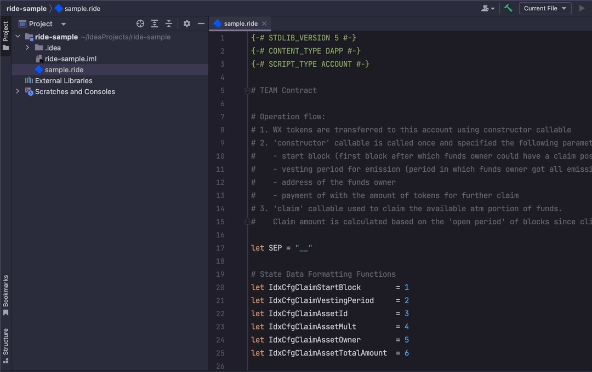
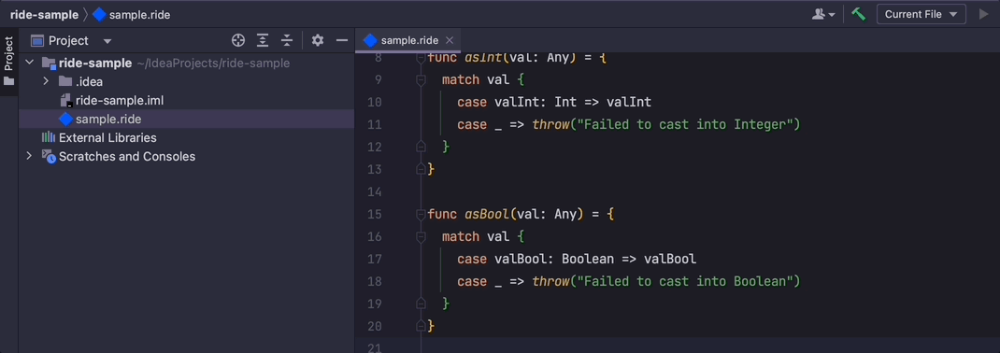
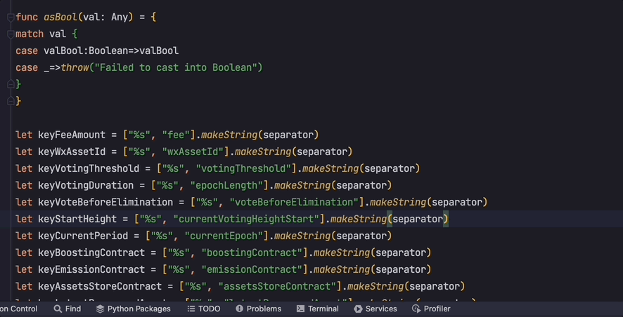
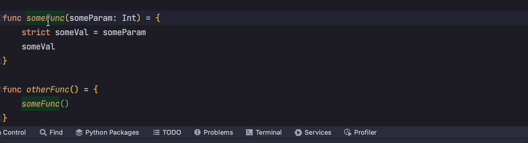

# RIDE plugin

<!-- Plugin description -->
The plugin provides support for [RIDE language](https://docs.waves.tech/en/ride/). 
Features:
<ul>
  <li>Syntax validation</li>
  <li>Keyword completion</li>
  <li>Built-in structures, types and functions completion</li>
  <li>User-defined functions completion</li>
  <li>User-defined variables completion</li>
  <li>Syntax highlighting and color schemes</li>
  <li>Ride file creation from lookup</li>
  <li>Code navigation</li>
</ul>
<!-- Plugin description end -->

## Installation

- Using IDE built-in plugin system:
  
  <kbd>Settings/Preferences</kbd> > <kbd>Plugins</kbd> > <kbd>Marketplace</kbd> > <kbd>Search for "ride"</kbd> >
  <kbd>Install Plugin</kbd>
  
- Manually:

  Download the [latest release](https://github.com/wavesplatform/ride-intellij-plugin/releases/latest) and install it manually using
  <kbd>Settings/Preferences</kbd> > <kbd>Plugins</kbd> > <kbd>⚙️</kbd> > <kbd>Install plugin from disk...</kbd>

---
## Features
- Syntax highlighting
    
  
    
- RIDE file creation
    
  
    
- Code completion
    
  
    
- Navigation
    
  
    
    
  
    
    
  
    
- Folding
    
  
    
- Reformatting
    
  
    
- Refactoring
    
  
    
---

Plugin based on the [IntelliJ Platform Plugin Template][template].

[template]: https://github.com/JetBrains/intellij-platform-plugin-template
